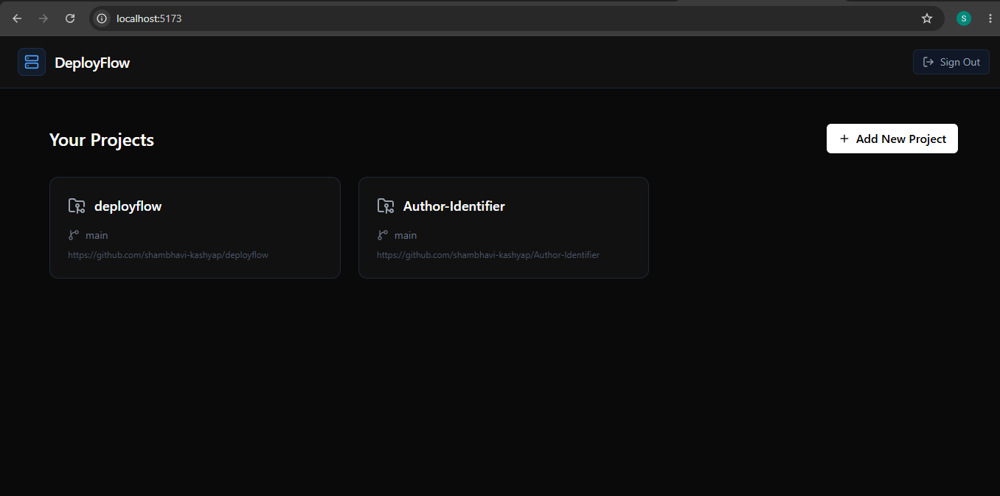
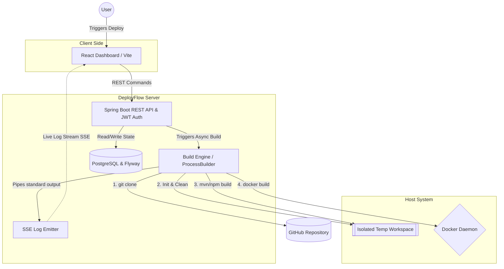
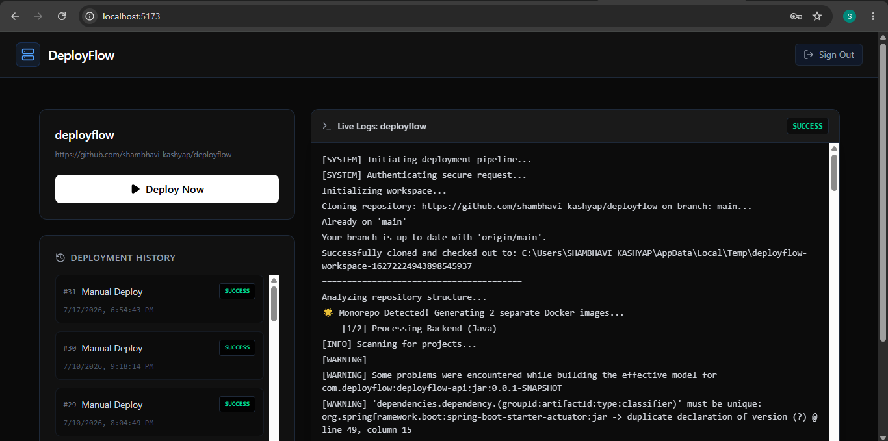
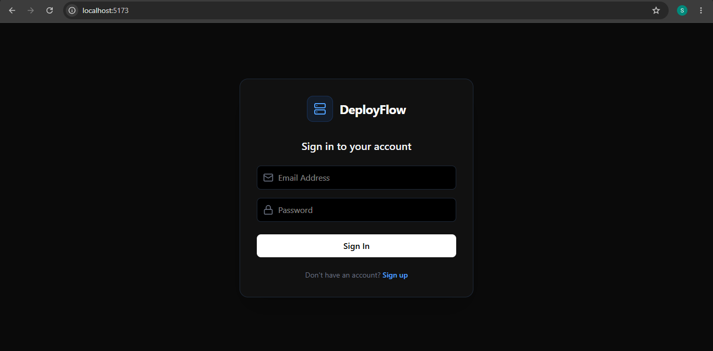

# DeployFlow

**DeployFlow** is a self-hosted CI/CD deployment platform built entirely from scratch. Inspired by tools like Vercel and GitHub Actions, it automates repository builds and Docker image generation—allowing users to clone, compile, and package both monolithic and monorepo applications into ready-to-deploy containers with a single click.

I built DeployFlow to demystify the magic behind modern CI/CD platforms. I wanted to understand how tools like Vercel manage isolated build environments, stream logs in real-time, and orchestrate containerization from a single repository.


## Dashboard Overview




## Key Features

* **Smart Monorepo Detection:** Automatically scans directories to identify and independently build both React/Node.js frontends and Java/Spring Boot backends from a single repository.
* **Live Deployment Logs:** Utilizes Server-Sent Events (SSE) to stream real-time build and compilation logs directly to the React dashboard.
* **Dynamic Build Engine:** Leverages Java `ProcessBuilder` to orchestrate native `git clone`, `mvnw package`, `npm build`, and `docker build` commands dynamically.
* **Secure Authentication:** Implements stateless JWT (JSON Web Tokens) authentication with BCrypt password hashing and Spring Security.
* **Automated Containerization:** Automatically detects `Dockerfile` configurations and packages successful builds into distinct Docker images.

## Live Deployment Engine
Streams real-time build and compilation logs directly to the React dashboard via Server-Sent Events (SSE). Automatically detects monorepo structures to build backend and frontend images simultaneously.



## Tech Stack

**Frontend:**
* React 18 (Vite)
* TypeScript
* Tailwind CSS
* Lucide Icons

**Backend:**
* Java 21 / Spring Boot 3
* Spring Security & JWT
* Spring Data JPA / Hibernate
* PostgreSQL
* Flyway (Database Migrations)

**DevOps & Infrastructure:**
* Docker
* Maven / NPM
* Git Integration

## Local Setup & Installation

### Prerequisites
* Java 21+
* Node.js 18+
* PostgreSQL 14+
* Docker Desktop (Running)
* Git

### 1. Database Configuration
Create a local PostgreSQL database named `deployflow`:
```sql
CREATE DATABASE deployflow;
```

Ensure your `deployflow-api/src/main/resources/application.yml` contains your correct database credentials.

### 2. Backend Setup (Spring Boot)
Navigate to the API directory and start the Spring Boot server:
```bash
cd deployflow-api
./mvnw clean install -DskipTests
./mvnw spring-boot:run
```

The backend will automatically run database migrations via Flyway and start on `http://localhost:8080`.

### 3. Frontend Setup (React)
Open a new terminal, navigate to the frontend directory, install dependencies, and start the Vite development server:
```bash
cd frontend
npm install
npm run dev
```

Access the dashboard at `http://localhost:5173`.

## Secure Authentication
Stateless JWT authentication with BCrypt password hashing and Spring Security.



## How it Works

1. **Authenticate:** Create a secure account and log into the dashboard.

2. **Import Project:** Add a GitHub repository URL and branch name.
3. **Deploy:** Click "Deploy Now". The async Build Engine will:
   * Create a temporary, isolated workspace.
   * Clone the repository from GitHub.
   * Analyze the directory structure (detecting Java, Node, or Monorepo structures).
   * Execute the appropriate native build commands (Maven/NPM).
   * Package the compiled artifacts into distinct Docker images. Images are stored in the local Docker daemon, ready for deployment.
   * Clean up the temporary workspace.
4. **Monitor:** Watch the build process in real-time via the live terminal log viewer.

## Future Roadmap

While fully functional as an MVP, the following architectural enhancements are planned for production scaling:

* **Message Broker Integration:** Implement RabbitMQ/Kafka to queue deployment requests and prevent I/O thread exhaustion under heavy load.
* **Webhook Automation:** Parse GitHub push event webhooks and verify HMAC-SHA256 signatures to trigger deployments automatically.
* **Automated Rollbacks:** Implement versioned container tagging to allow users to instantly revert their live application to a previously successful build in case of a critical failure.
* **Secrets Management:** Implement an interface for users to securely inject encrypted environment variables directly into the Docker build process.
* **Automated Test Execution:** Implement CI validation gates to automatically run repository test suites (e.g., `mvn test` or `npm test`) within the isolated workspace prior to containerization, ensuring only verified, passing code is deployed.

---
